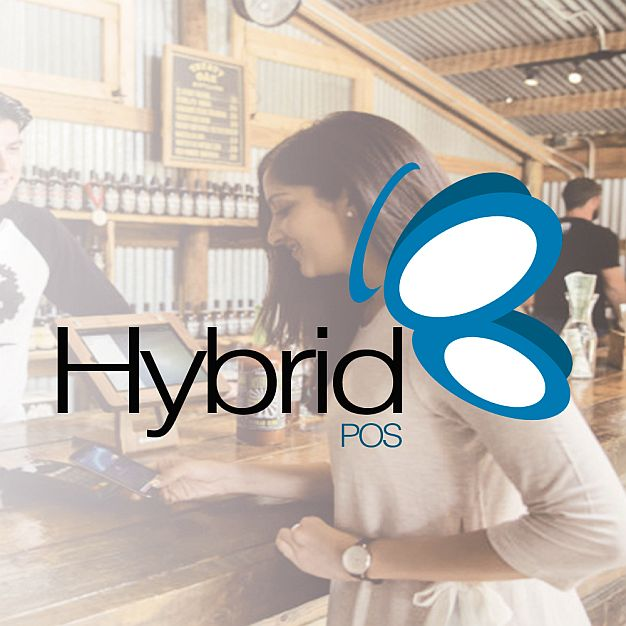

# ¿Qué es HybridLite?

**HybridLiteOS** es un sistema de gestión administrativa diseñado para controlar y optimizar las operaciones clave de las empresas: inventario, cuentas por cobrar, compras, cuentas por pagar, bancos y más.

Este sistema permite generar informes y libros fiscales requeridos por la normativa vigente, y se caracteriza por su alta flexibilidad fiscal:

- **Multiimpuesto**: permite crear las alícuotas necesarias tanto para operaciones de compra como de venta.
- **Multiretención**: configurable con grupos y tipos de retenciones con correlativos independientes por grupo, y capacidad de cálculo de hasta **seis decimales**.
- **Multimoneda**: desarrollado desde sus orígenes como sistema multimoneda, permite registrar operaciones en distintas monedas con precisión y control.

---
# ¿Qué ofrece HybridLite?

HybridLite es el módulo de gestión administrativa que incorpora un conjunto robusto de funcionalidades diseñadas para adaptarse a diversas realidades comerciales y fiscales. Entre sus principales capacidades:

- 🧾 **Sistema Multiimpuesto**: permite crear alícuotas específicas para compras y ventas, adaptándose a cualquier tipo de régimen fiscal.
- 📐 **Multiretención**: configurable por grupo con tipos de retención y numeraciones independientes, manejando hasta **cinco decimales** en sus cálculos.
- 💱 **Multimoneda**: desarrollado desde sus orígenes como sistema multimoneda, con posibilidad de mostrar resultados e informes en diferentes divisas.
- 💳 **Múltiples formas de pago**: posibilidad de definir y utilizar diversas modalidades de pago según las necesidades del comercio.
- 🌲 **Clasificación jerárquica**: permite crear "niveles" y "clases" para estructurar y relacionar módulos, aplicando filtros para obtener resultados específicos en reportes y análisis.
- 📦 **Inventario versátil**: gestión de productos, productos compuestos, fabricados y servicios.
- 🔍 **Control de inventario avanzado**: manejo por lotes, costo promedio y matrices de productos.
- 💲 **Seis tipos de precios**, incluyendo precios escalonados por cantidad.
- 🧾 **Compras completas**: órdenes de compra, recepción (notas de entrega) y cuentas por pagar a proveedores.
- 📝 **Emisión de pedidos, cotizaciones y presupuestos** para clientes, con trazabilidad completa.
- 📥 **Cuentas por cobrar**: incluye manejo de pagos, anticipos y retenciones a clientes.
- 📤 **Cuentas por pagar**: permite registrar pagos, anticipos y retenciones a proveedores.
- 🔁 **Ajustes de inventario**: sobre existencias, impuestos y precios, incluyendo recálculo automático por variaciones en el factor de cambio.
- 📊 **Informes y libros fiscales configurables**, adaptables a requerimientos legales y necesidades de gestión.
- 🌐 **Soporte multilingüe**: interfaz y reportes adaptables a distintos idiomas.
- 💸 **Informes de ventas realistas**: los reportes reflejan el valor en la moneda real de la transacción.
- 👥 **Gestión de vendedores y comisiones**, con seguimiento por cliente o documento.
- 🏦 **Módulo bancario completo**: control de cuentas contables y bancarias.
- 🔄 **Operaciones bancarias integradas** desde Cuentas por Cobrar y Cuentas por Pagar, sin necesidad de duplicar procesos.

---

# ¿Qué es HybridPOS?

**HybridPOS** es el módulo de ventas o facturación integrado a HybridLite, diseñado con características avanzadas para la emisión y control de todos los documentos fiscales relacionados con las operaciones comerciales.

---

# ¿Qué ofrece HybridPOS (Módulo de Ventas)?

HybridPOS es una solución versátil capaz de adaptarse a distintos modelos de negocio, desde comercios minoristas hasta empresas de servicios. Entre sus principales capacidades:

- 🧾 **Documentos comerciales completos**: permite generar presupuestos, pedidos, notas de entrega y facturas.
- ⚡ **Facturación rápida**: diseñada para entornos de alta rotación como supermercados o farmacias.
- 🛍️ **Flexibilidad comercial**: se adapta a supermercados, farmacias, ferreterías, restaurantes, empresas de servicios y más.
- 🖲️ **Botonera dinámica y áreas de servicio**: creación de botones ilimitados y gestión de mesas, cuentas y puestos de trabajo por áreas.
- 🧪 **Gestión de lotes por vencimiento**: con sugerencias automáticas al momento de la venta.
- 💱 **Multimoneda**: acepta múltiples divisas para cobros y reportes.
- 📈 **Precios por escala**: con activación opcional basada en cantidades.
- 💳 **Pagos mixtos y combinados**: admite múltiples formas de pago en una misma transacción, incluso en distintas monedas.
- 💵 **Corte X y desglose multimoneda**: para control operativo detallado.
- 🧾 **Cierre Z**: resúmenes consolidados por turno o jornada.
- 🔐 **Bitácora de seguridad**: registro de intentos de operación no autorizada, solicitando clave de acceso.
- 🌐 **Facturación electrónica**: cumplimiento con normativas fiscales digitales.
- 🖨️ **Soporte para impresoras fiscales**: integración directa con equipos compatibles.
- ♻️ **Gestión de residuos de inventario por lote**: permite crear nuevos lotes a partir de remanentes.
- 📐 **Variables de cálculo dinámico**: posibilidad de aplicar una o dos variables (ej. ancho × largo) para determinar cantidades.
- 📊 **Indicadores visuales por sala o área**: incluye control de ocupación, tiempo de atención y estado por mesa o puesto.
- 👤 **Control de usuarios por función**: gestión de claves y permisos para vendedores, cajeros o mesoneros.
- ⚖️ **Soporte para balanza conectada**: permite pesar productos directamente desde la interfaz POS.
- 🏷️ **Lectura de etiquetas con código de barras**: compatible con etiquetas de balanzas y productos codificados.
- 🏠 **Cuentas por la casa y por empleados**: separa consumos internos para mejor análisis financiero.
- 🖨️ **Múltiples formatos de impresión**: configurable por tipo de operación, con salida a impresora, pantalla o correo electrónico.

---