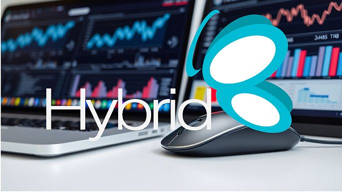

# Requisitos Técnicos

Este apartado describe los requisitos técnicos mínimos y recomendados para garantizar el correcto funcionamiento del sistema **Hybrid**, tanto en instalaciones tipo *stand alone*, como en entornos cliente/servidor con estación principal o servidor dedicado.

---

## 💻 Estación de Cliente / Instalación Stand Alone / Estación Principal (Requisitos Mínimos)

| Componente         | Especificación                                                                 |
|--------------------|--------------------------------------------------------------------------------|
| **Procesador**      | - Intel® Core™ i3 de 6ª generación o superior *(recomendado: 8ª generación)*    - AMD Ryzen™ 3 3300X o superior *(recomendado: Ryzen 5 5000G)* |
| **Memoria RAM**     | 8 GB                                                                          |
| **Monitor**         | Resolución mínima de 1024×768                                                 |
| **Puertos**         | Al menos un puerto USB 2.0 en buen estado                                     |
| **Almacenamiento**  | 120 GB de espacio libre en disco duro                                         |
| **Sistema operativo** | Windows 10 Pro (64 bits) o superior                                                   |

---

## 🖥️ Servidor (Requisitos Recomendados)

| Componente         | Especificación                                                                 |
|--------------------|--------------------------------------------------------------------------------|
| **Procesador**      | - Intel® Core™ i7 de 6ª generación o superior *(recomendado: 8ª generación)*    - AMD Ryzen™ 5 5500X o superior *(recomendado: Ryzen 7 5500G)* |
| **Memoria RAM**     | 8 GB o superior                                                               |
| **Monitor**         | Resolución mínima de 1024×768                                                 |
| **Puertos**         | Al menos un puerto USB 2.0 funcional                                          |
| **Almacenamiento**  | 250 GB de espacio libre *(se recomienda arreglo RAID 1)*                      |
| **Sistema operativo** | Windows Server 2019, 2022 o superior                                       |

---

## 🌐 Requisitos Adicionales

- 🔒 **Conexión a internet activa** para la validación y activación de licencias del sistema.
- 🖨️ Si se utilizarán **impresoras fiscales**, estas deben estar actualizadas con el **firmware oficial más reciente**. Consulte con un distribuidor autorizado.
- 🧷 **Conexión de red estable**, preferiblemente **por cable**, utilizando componentes **Gigabit Ethernet (1000Base-T)** para un rendimiento óptimo.
- 🛡️ Se recomienda usar **antivirus original y de pago**. Evite versiones gratuitas. En su defecto, se sugiere **Microsoft Defender** como alternativa confiable y nativa de Windows.

---
